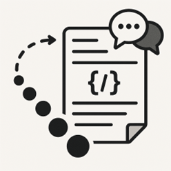
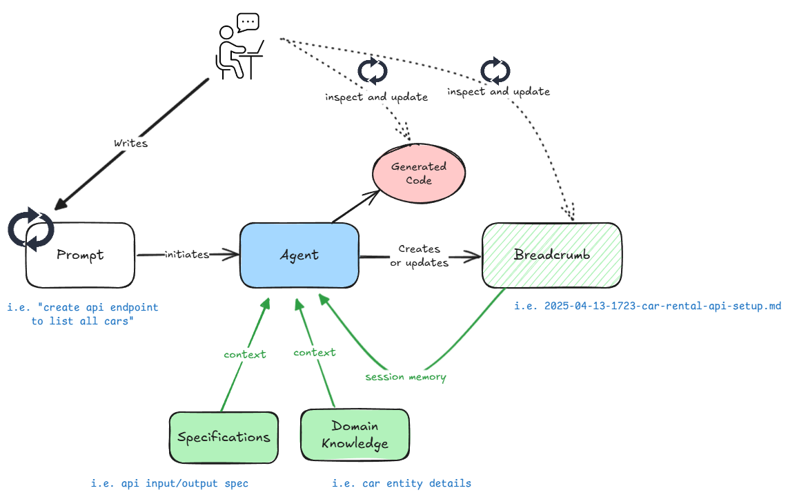

# Breadcrumb Protocol For AI Agent Collaboration

 

The Breadcrumb Protocol is a structured workflow for collaborating with AI agents during software development. It centres around creating and maintaining shared documentation files ("breadcrumbs") that track each task's progress and serve as a single source of truth.

This protocol creates a traceable history of decisions and implementations, making code reviews easier and ensuring both parties maintain shared context throughout development tasks.

## Overview

This repository serves as an example showcasing a structured approach for collaborating with AI agents (like GitHub Copilot Chat or similar LLM-based assistants) during software development. It provides a specific set of instructions, defined within this project, that guide the AI agent's behaviour to ensure clarity, maintain context, and produce well-documented changes.

The core idea is to establish a predictable and transparent workflow where the AI agent acts as a diligent collaborator, leveraging project-specific knowledge and adhering to a defined process for planning, implementation, and documentation.

## Development Workflow



[*Assumes spec is already created...*]
1. Prompt the agent: 
    ```text
    Help me create a aspnet api project according to the spec. I don't need the database context just yet so we can return a hardcoded response from the request processor.

    Location: src/backend/
    Solution name: CarRental
    Project name: CarRental.Api

    Use dotnet 9. Use this document on instructions of how to add swagger/openapi endpoint. https://devblogs.microsoft.com/dotnet/dotnet9-openapi/
    ```
2. Follow conversation with agent.
    - Provide input, confirm plans.
    - If the agent in veering off path, pause, give it instructions and ask to update the breadcrumb with the new context before continuing.
    - You also have the opportunity to update breadcrumb yourself and start a new conversation with the agent and continue from where it left off.
3. Results in breadcrumb: [2025-04-13-1723-car-rental-api-setup.md](github/.copilot/breadcrumbs/2025-04-13-1723-car-rental-api-setup.md)

## How It Works: Agent Instructions

The AI agent operating within this repository is expected to follow a specific set of rules and protocols defined in its prompt (often configured within the AI tool's settings or provided at the start of an interaction). 

See the [full prompt](.github/copilot-instructions.md) for more details.

Key aspects of these instructions include:

1.  **Domain Knowledge Integration:**
    * The agent uses files within `.github/.copilot/domain_knowledge` as the authoritative source for understanding the project's context, entities, workflows, and language.
    * It is expected to update these files as the understanding of the domain evolves during development.

2.  **Specification Adherence:**
    * The agent refers to specification files located in `.github/.copilot/specifications` to guide implementation.
    * It uses a defined template (`.github/.copilot/specifications/.template.md`) for structure and clarifies which specifications are relevant if needed.

3.  **The Breadcrumb Protocol:** This is the central pillar of the collaborative process:
    * **Purpose:** To create a shared "scratchpad" or log (a "breadcrumb" file) for each task, ensuring alignment between the user and the agent, and documenting the development journey.
    * **Creation:** For each new task, a breadcrumb file is created in `.github/.copilot/breadcrumbs` with the format `yyyy-mm-dd-HHMM-{title}.md`.
    * **Structure:** Each breadcrumb file includes mandatory sections: Requirements, User Comments, Plan, Decisions, Implementation Details, Changes Made, Before/After Comparison, and References.
    * **Workflow:**
        * Updates happen *before* coding changes.
        * The implementation **Plan** requires explicit user approval before starting work.
        * The breadcrumb is updated *after* each significant change.
        * It serves as the single source of truth for the task's context and progress.
    * **Planning:** Plans are structured into phases and tasks, include checklists, reference domain knowledge/specs, prioritize tests, and have clear success criteria.
    * **Execution:** The agent follows the approved plan, marks tasks as complete *after* successful implementation (including passing tests), and updates the breadcrumb accordingly.

## Repository Structure
`.github/copilot-instructions.md`: contains instruction for the agent.

`.github/.copilot/` directory is crucial for this workflow:
* `domain_knowledge/`: Contains files defining the project's context and rules.
* `specifications/`: Holds requirement specifications, organized by feature or area.
    * `.template.md`: Template for new specification files.
* `breadcrumbs/`: Stores the collaborative log files created for each task according to the Breadcrumb Protocol.

Example
```text
.github/.copilot/
├── breadcrumbs/
│   ├── 2025-04-13-0130-car-rental-entity-model.md
│   ├── 2025-04-13-0135-aspnet-core-api-specification.md
│   └── 2025-04-13-1723-car-rental-api-setup.md
│
├── domain_knowledge/
│   └── entities/
│       └── car-rental-entities.md
│
└── specifications/
    ├── application_architecture/
    │   └── aspnet-core-minimal-api.spec.md
    └── .template.md
```

## Goal

By enforcing these instructions, this repository demonstrates a method to:

* Improve the reliability and predictability of AI agent contributions.
* Maintain a clear, documented trail of requirements, decisions, and implementation steps.
* Facilitate easier review of changes by linking code modifications back to the documented plan and reasoning within the breadcrumb files.
* Ensure the agent consistently leverages project-specific context (domain knowledge and specifications).

This setup provides a template and example for teams looking to integrate AI agents more deeply and effectively into their development workflows.
